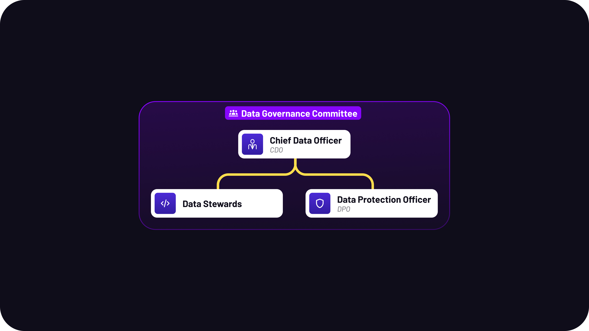
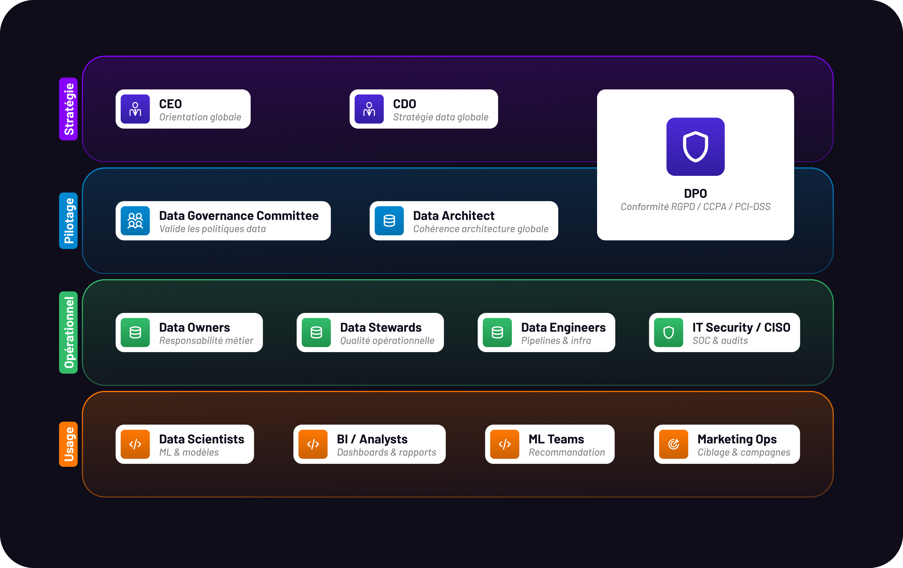

# Politique de Gouvernance des Données

## 1. Introduction

Chez Spotify, la donnée alimente les algorithmes, améliore l'expérience des utilisateurs et constitue un actif stratégique à l'échelle mondiale. Dans ce contexte, la gouvernance des données doit garantir **fiabilité, conformité et éthique** de leur utilisation.

Ce document définit les principes, les exigences de conformité et les rôles encadrant la gestion des données chez Spotify. Il s'applique à l'ensemble des employés, partenaires et systèmes manipulant des données personnelles, opérationnelles ou analytiques.

## 2. Principes de gouvernance des données

*Source : Governance Principles Guide*

La gouvernance des données chez Spotify repose sur neuf principes fondamentaux :

| **Principe** | **Engagement** | **Mise en œuvre** |
| --- | --- | --- |
| **Responsabilité** | Chaque dataset possède un Data Steward désigné | Matrice RACI — Comité de Gouvernance |
| **Transparence** | *"All data processing activities must be transparent to users"* | Politique de confidentialité — documentation des flux |
| **Sécurité** | Protection maximale des données sensibles | RBAC — MFA — chiffrement AES-256 — PCI-DSS pour les paiements |
| **Qualité** | *"Spotify must ensure the data it collects is accurate, complete, and reliable"* | Scores qualité sur 5 dimensions — audits trimestriels |
| **Conformité** | *"Spotify's data governance must comply with GDPR, CCPA, and PCI-DSS"* | DPO dédié — programme de formation continue |
| **Minimisation** | Collecter uniquement les données nécessaires aux finalités définies | Suppression automatique — validation de toute nouvelle collecte |
| **Droits utilisateurs** | *"Users should be able to easily access, modify, or delete their personal data"* | Portail utilisateur — traitement sous 30 jours |
| **Amélioration continue** | *"Regular assessments and improvements should be made to the governance framework"* | Veille réglementaire — revue annuelle |
| **Éthique** | Usage responsable des données et des systèmes d'IA | Transparence algorithmique — tests de biais sur les modèles ML |

## 3. Conformité réglementaire

*Source : Compliance Checklist*

Spotify adopte une approche **privacy-by-design** et **privacy-by-default** pour l'ensemble de ses traitements.

### RGPD (Europe)

| **Exigence** | **Mise en œuvre** |
| --- | --- |
| Consentement explicite | Requis pour le profilage, la publicité ciblée et les données sensibles |
| Droits des utilisateurs | Accès, rectification, suppression, portabilité, opposition — traitement sous 30 jours |
| Notification des violations | Détection et notification aux autorités sous 72h |
| Transferts internationaux | Clauses contractuelles types (SCC) — audits des fournisseurs tiers |
| DPO | Nommé, indépendant fonctionnellement, rattaché au Board (RGPD art. 38) |

### CCPA (Californie)

| **Exigence** | **Mise en œuvre** |
| --- | --- |
| Droit d'opt-out | Les utilisateurs californiens peuvent s'opposer à la vente de leurs données |
| Transparence | Publication annuelle des catégories de données collectées et de leur usage |
| Non-discrimination | Aucune dégradation de service pour les utilisateurs exerçant leurs droits |

> PCI-DSS s'applique aux flux de paiement Premium (Stripe, PayPal, Apple Pay) : tokenisation obligatoire, audit annuel QSA, cartographie des flux de données de paiement.
> 

## 4. Rôles et responsabilités

*Source : Data Governance Role Template*

La gouvernance des données repose sur quatre rôles clés qui fonctionnent en synergie :

| **Rôle** | **Responsabilité principale** | **Rattachement** |
| --- | --- | --- |
| **Chief Data Officer (CDO)** | *"Lead the data governance strategy and oversee data management across Spotify"* — définit les politiques et s'assure de leur alignement avec les objectifs métier | CEO |
| **Data Protection Officer (DPO)** | *"Ensure compliance with data protection regulations such as GDPR and CCPA"* — point de contact avec les autorités — indépendant fonctionnellement | Board / CEO |
| **Data Stewards** | *"Ensure data accuracy, consistency, and reliability"* — appliquent les politiques de gouvernance au niveau opérationnel par domaine métier | CDO |
| **Data Governance Committee** | *"Guide the data governance framework and ensure alignment across the organization"* — valide les politiques, arbitre les conflits inter-départements | Board |

Ces rôles fonctionnent en synergie : le CDO dirige la stratégie, le DPO agit comme autorité indépendante sur la conformité, les Data Stewards assurent la qualité opérationnelle, et le Comité de Gouvernance oriente et valide l'ensemble.

## 5. Processus de gouvernance

Le cadre opérationnel comprend :

- **Revues trimestrielles** de conformité et de qualité pilotées par le Data Governance Committee.
- **Audits internes annuels** évaluant l'efficacité des politiques (qualité, sécurité, conformité).
- **Gestion du cycle de vie des données** : de la collecte à la suppression sécurisée, selon les durées de rétention définies par type de données.
- **Procédures d'alerte et de correction** : tout incident affectant des données sensibles est notifié au DPO sous 4 heures.
- **Révision annuelle** du présent document, validée par le Comité de Gouvernance. Période de transition de 30 jours pour toute mise à jour majeure.

# 6. Schéma organisationnel

J’ai produit deux livrables complémentaires. Le premier répond strictement au périmètre demandé : les 4 rôles définis dans le Roles Template. Le second représente la vision organisationnelle cible que le framework de gouvernance doit permettre d'atteindre à horizon 18 mois, alignée sur le modèle Center of Excellence recommandé dans les ressources.

## Schéma Simple (As-Is)

# Ce vers quoi Spotify doit tendre (To-Be)

