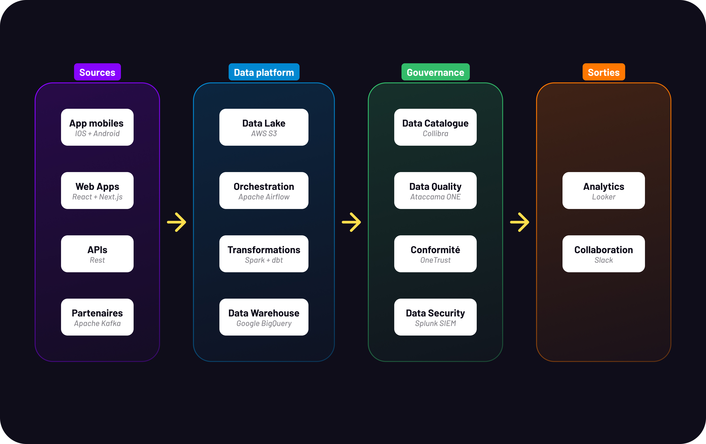

# 3. implementing the Data Governance Framework

## 1. Modèle organisationnel retenu

Spotify adopte le modèle **Center of Excellence (CoE) avec gouvernance fédérée** — un modèle hybride combinant un CoE central piloté par le CDO et des Data Stewards locaux dans chaque domaine métier et région.

| **Modèle** | **Verdict** | **Raison** |
| --- | --- | --- |
| Centralisé | ✗ | Trop rigide pour 180+ marchés — limiterait l'autonomie des équipes |
| Décentralisé | ✗ | Aggraverait les silos existants — absence de source unique de vérité |
| **CoE (retenu)** | ✅ | Standards communs + autonomie locale — adapté à la maturité et taille de Spotify |

| **CoE central** | **Équipes départementales** |
| --- | --- |
| Définit les politiques et standards | Appliquent les standards dans leur contexte |
| Fournit les outils et l'infrastructure | Gèrent la qualité de leurs données |
| Forme et certifie les Data Stewards | Remontent les problématiques au CoE |
| Audite la conformité et suit les KPIs | Innovent avec les données dans leur domaine |

Le CoE est déployé **progressivement** — Spotify est actuellement à 2.5/5 de maturité. Un pilote sur les données utilisateurs UE précède le déploiement global.

## 2. Technologies et outils recommandés

| **Catégorie** | **Outil** | **Objectif** |
| --- | --- | --- |
| Data Catalog & Lineage | Collibra | *"Facilitates data discovery"* — inventaire automatisé, traçabilité visuelle |
| Data Quality | Ataccama ONE | Profilage, nettoyage, déduplication automatisés |
| Conformité RGPD / CCPA | OneTrust | *"Manages compliance with GDPR, CCPA"* — gestion des consentements |
| Sécurité / SIEM | Splunk | Monitoring temps réel, audit logs, alertes SOC |
| Orchestration ETL | Apache Airflow | Automatisation des pipelines |
| BI & Analytics | Looker + BigQuery | Dashboards décisionnels, suivi des KPIs |
| Collaboration | Confluence / Slack | Documentation + communication |

### Architecture d'intégration

**Principes d'architecture** : cloud native, auto-scaling, chiffrement systématique, documentation automatique des transformations, logs et métriques sur tous les composants.

## 3. Plan pilote — Données utilisateurs UE

### Périmètre et justification

Le pilote porte sur les **données utilisateurs européens** : profils (âge, pays, préférences), données d'écoute (tracks, playlists, historiques), consentements et préférences privacy, features de recommandation ML.

Ce choix s'explique par trois raisons : données à fort enjeu business (recommandation, churn, monétisation), fort risque réglementaire (RGPD), et forte transversalité entre Produit, Marketing, Data, Legal et Engineering.

### Équipe pilote

| **Rôle** | **Responsabilité** |
| --- | --- |
| CDO | Sponsor stratégique — valide les objectifs et jalons |
| DPO | Conformité RGPD / CCPA / PCI-DSS — audit et cartographie |
| Data Steward UE | Qualité opérationnelle — nettoyage et documentation |
| Data Engineer | Pipelines et intégration — connexion des sources dans Collibra |
| IT Security / CISO | Monitoring Splunk — contrôle des accès |
| Data Governance Committee | Instance de supervision — valide les jalons |

### Calendrier

| **Phase** | **Actions** | **Période** |
| --- | --- | --- |
| **Phase 1 — Pilote UE** | Audit + désignation Data Steward UE → déploiement Collibra + Ataccama → formation + mise en conformité RGPD | Mois 1–6 |
| **Phase 2 — Extension** | Déploiement Amérique du Nord (CCPA) + APAC (PDPA) | Mois 7–12 |
| **Phase 3 — Généralisation** | Tous départements, toutes régions — modèle CoE complet | Mois 13–24 |

### KPIs du pilote (cibles à M6)

| **Domaine** | **KPI** | **Cible** |
| --- | --- | --- |
| Qualité | Score qualité données UE | ≥ 85% |
| Qualité | Réduction des doublons | -30% |
| Conformité | Consentements documentés | 100% RGPD |
| Accessibilité | Temps d'accès aux données | -40% |
| Sécurité | Incidents critiques | 0 |
| Adoption | Satisfaction utilisateurs | ≥ 4/5 |

## 4. Matrice RACI × DMBOK

| **Action pilote** | **Data Gov** | **Data Quality** | **Conformité** | **Sécurité** | **Metadata** | **R** | **A** | **C** | **I** |
| --- | --- | --- | --- | --- | --- | --- | --- | --- | --- |
| Désignation Data Steward | ✓ |  |  |  |  | CDO | CDO | DPO | Métiers |
| Cartographie données UE | ✓ |  | ✓ |  | ✓ | DS | CDO | DPO, DE | BI |
| Classification sensibilité | ✓ |  | ✓ | ✓ | ✓ | DS | DPO | Legal, Sec | Métiers |
| Déploiement Data Catalog | ✓ | ✓ |  |  | ✓ | DS | CDO | DE | Métiers |
| Contrôles qualité automatisés |  | ✓ |  |  | ✓ | DE | CDO | DS | BI |
| Processus RGPD | ✓ |  | ✓ | ✓ |  | DS | DPO | Legal | Métiers |
| Gestion des accès | ✓ |  | ✓ | ✓ |  | Sec | CDO | DPO | DS |
| KPI & suivi gouvernance | ✓ | ✓ | ✓ |  | ✓ | DS | CDO | DO, DE | CoE |

## 5. Gestion des risques

| **Risque** | **Probabilité** | **Impact** | **Mitigation** |
| --- | --- | --- | --- |
| Résistance au changement | Élevée | Moyen | Formation ciblée + sensibilisation |
| Qualité initiale insuffisante | Élevée | Élevé | Audit automatique Ataccama dès M1 |
| Non-conformité RGPD | Moyenne | Élevé | Audit DPO M3 + OneTrust |
| Difficultés d'intégration technique | Moyenne | Élevé | Tests avant production — DE impliqués dès M1 |
| Dépassement budgétaire | Moyenne | Moyen | Marges planifiées + suivi mensuel CDO |