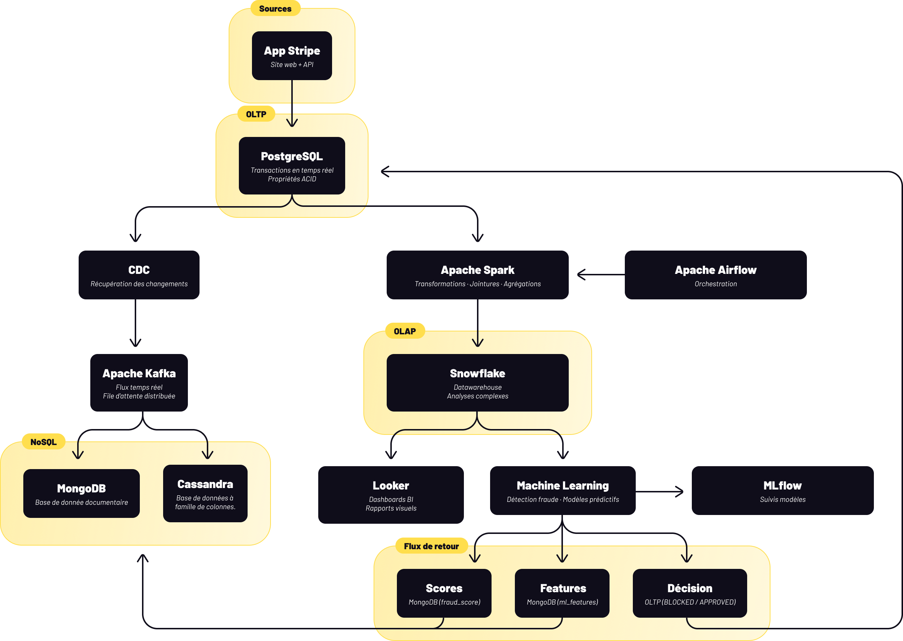
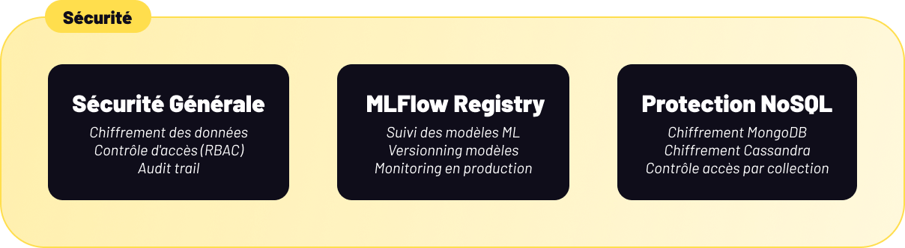
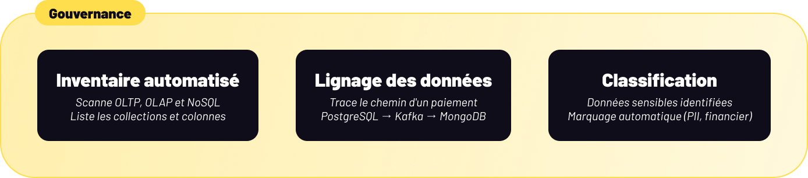

# 1. Diagramme d'architecture de données complet

# Contexte & problème business

Stripe est l'une des plateformes de paiement les plus utilisées à l'échelle mondiale. Chaque seconde, des milliers de transactions sont traitées via son API, représentant chacune de l'argent réel, des clients réels, et des risques réels.

À un certain niveau de volume, un problème devient inévitable : les transactions frauduleuses passent avant même d'être scorées. Le système réalise trop tard. Le dégât est fait.

La question devient alors : **comment scorer une transaction au moment où elle arrive, et non après ?**

C'est cette question qui rend le problème intéressant. Parce que dès qu'on décide de faire de la détection en temps réel, chaque choix architectural devient critique. On ne peut plus se permettre de perdre une donnée en route. On ne peut plus accepter une latence trop longue entre l'arrivée d'un paiement et la décision de le bloquer ou de le laisser passer. Et on ne peut pas non plus casser la cohérence du système en essayant d'aller vite.

# Les contraintes qui ont guidé les choix

Avant de détailler l'architecture, il est important de comprendre les axes de contrainte qui ont orienté la conception :

## **Latence**

La décision de bloquer ou autoriser une transaction doit être prise en millisecondes à quelques secondes. Cela impose un chemin de données rapide, sans passage obligatoire par un datawarehouse.

## **Volume & scalabilité**

Les flux de paiement sont erratiques par nature — pics soudains, saisonnalité. L'infrastructure doit absorber ces variations sans re-architeter.

## **Cohérence des données**

Une décision de fraude a un impact direct sur l'État de la transaction. Cette décision doit être écrite de manière fiable, sans risque de perte ou d'incohérence.

## **Résilience**

Un seul composant en panne ne doit pas paralyser le pipeline. Le système doit être découplé en ses points critiques.

## **Observabilité**

Dans un contexte de détection de fraude, chaque décision doit être traçable, auditeable, et les modèles utilisés doivent être versionnés et monitorés.

# Le schéma

Ce diagramme présente l'architecture complète des données de Stripe, depuis la source jusqu'à l'analyse. Les données opérationnelles sont ingérées via l'OLTP (PostgreSQL), puis distribuées sur deux chemins : un chemin temps réel passant par CDC et Kafka vers les bases NoSQL (MongoDB et Cassandra), et un chemin batch orchestré par Airflow et Spark vers l'OLAP (Snowflake). Les résultats des analyses et des modèles Machine Learning sont ensuite renvoyés vers les systèmes source via des flux de retour, garantissant une intégration complète entre l'ensemble des couches de l'architecture.

Cette section est le fil rouge de l'architecture. Plutôt que de présenter les composants isolément, voici ce qui se passe concrètement lorsqu'un utilisateur effectue un paiement.

Voir les schémas en détails : [Shémas](https://www.figma.com/design/1oQNOK9A0VxTsVj4pchtVo/Jedha?node-id=529-7850&t=EkZXICmDyPYAqCYM-11)

## Les étapes

**Étape 1 — Capture.** La transaction est initiée via l'application web ou l'API Stripe. Elle est immédiatement persistée dans **PostgreSQL**, notre base OLTP. PostgreSQL garantit ici la cohérence via ses propriétés ACID : la transaction est soit écrite, soit rejetée, jamais dans un état intermédiaire.

**Étape 2 — Détection du changement.** Le mécanisme de **CDC (Change Data Capture)** détecte l'insertion en temps réel sur PostgreSQL. Cette approche permet de ne pas surcharger la base source avec des requêtes de polling régulières.

**Étape 3 — Streaming.** Le changement est poussé vers **Apache Kafka**, qui joue le rôle de file d'attente distribuée. Kafka découples la production de la consommation : même si le consommateur est momentanément indisponible, aucune donnée n'est perdue. C'est le point de résilience central du pipeline.

**Étape 4 — Transformation.** Les données sont consommées par **Apache Spark**, qui effectue les transformations, jointures avec des données historiques, et agrégations nécessaires pour préparer les features du modèle. L'orchestration de ces workflows est assurée par **Apache Airflow**, qui garantit l'ordonnancement, la gestion des erreurs, et la rejouabilité.

**Étape 5 — Stockage & analyse.** Les données transformées sont chargées dans **Snowflake** (OLAP), où elles sont disponibles pour l'analyse complexe et le reporting. En parallèle, les flux temps réel sont écris dans **MongoDB** et **Cassandra** pour les accès à faible latence.

**Étape 6 — Scoring.** Le modèle de détection de fraude consomme les données depuis Snowflake, génère un score, et émet une décision : **BLOCKED** ou **APPROVED**.

**Étape 7 — Boucle de retour.** C'est le point clé. La décision n'est pas stockée côté — elle remonte dans le système. Le score est écrit dans MongoDB, les features dans MongoDB, et la décision finale dans **PostgreSQL**. L'application lit cette décision et adapte son comportement en conséquence.

# La boucle de retour

La majorité des architectures ML en production traitent le modèle comme un composant périphérique : les données y entrent, un résultat sort, et c'est à peu près ça. Ici, c'est différent.

La décision du modèle remonte dans l'OLTP source via une écriture dans PostgreSQL. Cela signifie que chaque transaction est non seulement scorée, mais que cette décision influence directement l'état du système en temps réel. Si un paiement est bloqué, l'application le sait immédiatement.

Cette boucle crée un système **actif** plutôt que passif. Elle impose cependant une contrainte forte : la latence entre le moment où la transaction arrive et le moment où la décision est disponible doit être minimisée. C'est pourquoi les scores et features sont stockés dans MongoDB (accès à faible latence) plutôt que dans Snowflake.

# Justification des choix technologiques

Chaque outil a été retenu pour une raison précise, pas par convention.

**PostgreSQL** comme OLTP central, plutôt qu'une autre base relationnelle, parce qu'il offre un support natif du CDC via des mécanismes comme pgoutput, ce qui simplifie considérablement l'ingestion.

**Kafka** plutôt qu'un système de messaging plus simple (RabbitMQ par exemple), parce que le volume de transactions impose une file distribuée avec une rétention configurable et un partitionnement horizontal.

**Spark** plutôt que Flink pour les transformations, parce que le modèle de traitement micro-batch est suffisant ici et offre une compatibilité plus large avec l'écosystème Snowflake. Si la latence de transformation devenait critique, Flink serait la migration naturelle.

**Snowflake** comme datawarehouse plutôt que BigQuery ou Redshift, parce qu'il offre une séparation storage/compute qui permet de scaler les deux indépendamment — avantage direct sur des volumes irréguliers.

**MongoDB** pour les scores et features plutôt que Redis, parce que le besoin n'est pas seulement du cache mais du stockage persistant structuré, avec des requêtes par champ. Redis pourrait être utilisé comme couche de cache supplémentaire si la latence le nécessitait.

**Cassandra** pour les données historiques volumineuses à faible latence, parce que son modèle colonne et son partitionnement horizontal sont adaptés aux patterns de lecture par clé temporelle.

**MLflow** pour le suivi des modèles, parce qu'il offre nativement le versioning, le tracking des métriques, et le monitoring en production — toutes les capacités nécessaires pour gérer le cycle de vie du modèle de détection de fraude.

# Sécurité & Gouvernance

Ces deux piliers ne sont pas des ajouts a posteriori. Ils sont intégrés à la conception même de l'architecture.

**Sécurité.** Le chiffrement est appliqué à toutes les couches de stockage. L'accès est contrôlé via du RBAC, avec un audit trail complet sur les opérations sensibles. Sur les stores NoSQL, le contrôle d'accès est fait par collection, ce qui permet une granularité fine : un service peut lire les scores sans avoir accès aux features, par exemple. MLflow Registry garantit que seuls des modèles validés sont déployés en production, avec un historique complet.

**Gouvernance.** L'architecture embarque trois capacités de gouvernance : un inventaire automatisé de tous les assets de données (OLTP, OLAP, NoSQL, collections), un lignage traçable de chaque donnée depuis PostgreSQL jusqu'à son destination finale, et une classification automatique des données sensibles (PII, données financières) via du tagging. Ces trois capacités permettent de répondre rapidement à une question de type "où se trouve cette donnée, qui y a accès, et d'où elle provient" — essentiel dans un contexte réglementaire (PCI-DSS, RGPD).

# Risques identifiés & mitigation

Une architecture n'est pas parfaite. Ce qui compte, c'est d'avoir identifié les points de fragilité.

## **PostgreSQL comme source unique**

Si la base OLTP tombe, tout le pipeline s'arrête. La mitigation passe par une configuration haute disponibilité (réplication synchrone) et par le fait que Kafka, une fois les données ingérées, est indépendant de PostgreSQL.

## **Latence de la boucle de retour.**

Entre l'ingestion de la transaction et la décision du modèle, plusieurs étapes s'enchaînent (CDC → Kafka → Spark → ML → écriture). Si cette latence dépasse le seuil acceptable, la décision arrive trop tard. La mitigation actuelle repose sur le micro-batch Spark et l'écriture directe dans MongoDB. Si le besoin évolue, le passage à un traitement stream natif (Flink) pourrait être envisagé.

## **Cohérence eventual entre MongoDB et PostgreSQL.**

Les scores sont écrits dans MongoDB et la décision dans PostgreSQL de manière quasi-simultanée, mais pas transactionnelle. Un scénario d'échec partiel est possible. Une idempotence sur les écritures et un mécanisme de reconciliation périodique permettent de limiter ce risque.

# Perspectives d'évolution

L'architecture actuelle est cohérente et fonctionnelle. Plusieurs axes d'évolution sont envisageables selon les besoins futurs.

Le passage à un **data lakehouse** (Delta Lake ou Apache Iceberg) permettrait d'unifier les couches batch et streaming dans un même stockage, réduisant la complexité de maintien de deux chemins de données parallèles.

L'introduction d'un **feature store** entre Spark et le modèle ML garantirait la cohérence des features entre l'entraînement et l'inférence — un problème classique en production qui devient critique à l'échelle.

Si la latence de la boucle de retour devenait un goulot d'étranglement, le remplacement de Spark par **Apache Flink** pour le traitement des transformations real-time serait la migration la plus naturelle.