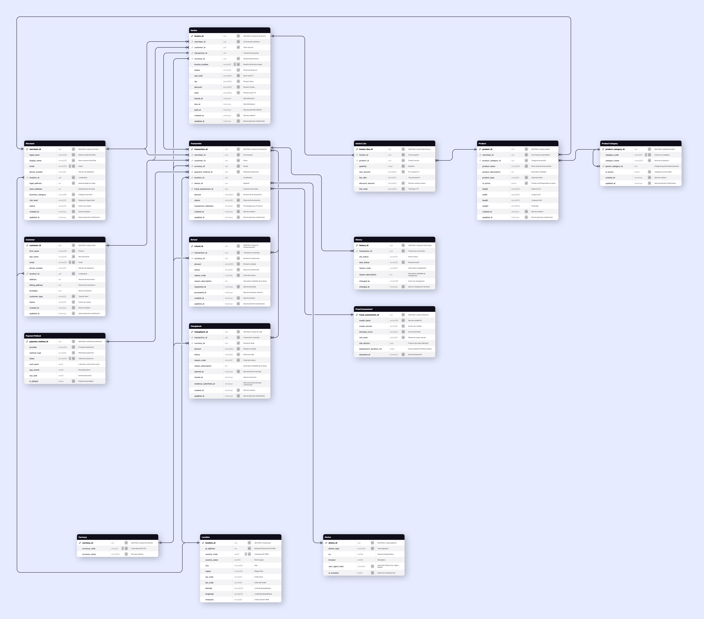

# 2. Diagramme entité-relation (ERD) pour système OLTP

# Introduction

Ce diagramme présente l'architecture transactionnelle (OLTP) conçue pour supporter les opérations temps réel de la plateforme Stripe. Il modélise l'ensemble du cycle de vie des transactions de paiement, depuis l'enregistrement des commerçants et clients jusqu'à la gestion des litiges et remboursements.

Voir le schéma en détail : [Shéma](https://www.figma.com/design/1oQNOK9A0VxTsVj4pchtVo/Jedha?node-id=483-5218&t=EkZXICmDyPYAqCYM-11)

# **Analyse de l'architecture OLTP selon les critères de qualité**

## Intégrité

L'intégrité des données financières est garantie par un ensemble de mécanismes structurels qui préviennent toute incohérence ou corruption des transactions.

- **Clés étrangères multiples** : Chaque entité financière référence obligatoirement ses parents, empêchant la création de données orphelines (ex: `Refund.transaction_id` → `Transaction.transaction_id`).
- **Séparation des domaines** : Les données commerçants et clients sont isolées dans des tables distinctes, évitant les corruptions croisées lors des opérations concurrentes.
- **Historisation complète** : Un système de traçabilité capture chaque modification avec acteur, raison et horodatage, créant un journal d'audit immuable (ex: `History` enregistre `old_status`, `new_status`, `changed_by`, `changed_at`).
- **Tables de référence centralisées** : Les codes métier sont normalisés dans des tables dédiées, garantissant leur unicité à travers tout le système (ex: `Currency.currency_id` utilisé par `Transaction`, `Refund`, `Chargeback`, `Invoice`).

## Performance

L'architecture optimise les temps de réponse pour supporter un volume transactionnel élevé avec des requêtes multi-critères rapides.

- **Indexation stratégique** : Les clés étrangères multiples permettent des recherches instantanées selon différents axes sans scan complet.
- **Dénormalisation ciblée** : Les montants et devises sont répétés dans les tables financières pour éviter les jointures lors des affichages fréquents (ex: `amount` présent dans `Transaction`, `Refund`, `Chargeback`, `Invoice`).
- **Tables de référence légères** : Les entités à faible volumétrie restent en cache mémoire, accélérant les jointures répétitives (ex: `Currency` avec 3 colonnes, `Device` avec 5 colonnes).
- **Partitionnement prévu** : Les timestamps systématiques facilitent le partitionnement temporel futur sans refonte.
- **Isolation anti-fraude** : L'évaluation des risques est découplée des requêtes transactionnelles standard.

## Scalabilité

La structure facilite la croissance exponentielle par distribution géographique et séparation des responsabilités métier.

- **Sharding géographique** : Le référencement précis des localisations permet de partitionner les données par région (ex: `Location.country_code` pour distribution EU/US/ASIA sur clusters distincts).
- **Architecture multi-tenant** : La séparation claire entre commerçants et clients facilite l'isolation en bases distinctes (ex: `Merchant` et `Customer` peuvent migrer vers des instances dédiées).
- **Réplication des référentiels** : Les tables quasi-statiques peuvent être dupliquées globalement sans conflits (ex: `Product`, `Product_Category`, `Currency` répliqués sur tous les datacenters).
- **Stockage différencié** : La croissance asymétrique permet des stratégies adaptées à la volatilité.
- **Append-only pattern** : L'historisation fonctionne sans mise à jour, autorisant l'insertion massivement parallèle (ex: `History` uniquement des INSERT, jamais d'UPDATE/DELETE).

## Conformité

L'architecture intègre nativement les exigences réglementaires bancaires et de protection des données.

- **PCI-DSS** : Les données de paiement sensibles ne sont jamais stockées en clair (ex: `Payment_Method` contient uniquement `token` et `card_last4`, pas le numéro complet).
- **Audit trail complet** : Chaque modification est tracée avec responsable et justification (ex: `History.changed_by`, `reason_code`, `reason_description` documentent qui, pourquoi, quand).
- **Explicabilité anti-fraude** : Les décisions algorithmiques sont documentées pour répondre aux exigences de transparence (ex: `Fraud_Assessment.model_name`, `model_version`, `risk_factors` justifient chaque évaluation).
- **Conservation légale** : Les timestamps obligatoires assurent la conformité aux délais de rétention réglementaires (ex: `created_at` et `updated_at` NOT NULL sur toutes les tables financières).
- **Gestion des litiges** : Les contestations bancaires suivent les processus Visa/Mastercard (ex: `Chargeback` avec `reason_code`, `evidence_submitted_at`, `opened_at`, `closed_at`).
- **Protection des données personnelles** : L'isolation facilite l'anonymisation sélective (ex: `Customer.email`, `birthdate` séparés des tables transactionnelles).

## Maintenabilité

La clarté structurelle et la cohérence du nommage réduisent le coût d'évolution et accélèrent l'onboarding des développeurs.

- **Normalisation stricte** : Chaque donnée n'existe qu'une seule fois, limitant la surface d'impact des modifications (ex: modifier le statut d'un remboursement impacte uniquement `Refund.status`).
- **Domaines métier explicites** : Les groupes de tables correspondent à des responsabilités distinctes permettant le travail en parallèle (ex: équipe Payment sur `Transaction`/`Refund`, équipe Billing sur `Invoice`/`Invoice_Line`).
- **Convention de nommage cohérente** : Les patterns systématiques facilitent la compréhension immédiate (ex: toutes les FK en `*_id`, tous les timestamps en `*_at`, tous les montants en `decimal(19,2)`).
- **Extensibilité sans refonte** : Les structures récursives permettent une croissance illimitée (ex: `Product_Category.parent_category_id` autorise une hiérarchie de profondeur infinie).
- **Documentation vivante** : Les relations entre tables servent de spécification exécutable (ex: les FK documentent visuellement qu'un `Invoice_Line` nécessite obligatoirement un `Product`).
- **Format flexible** : Les données métier évolutives évitent les migrations de schéma (ex: `Fraud_Assessment.risk_factors` en JSONB permet d'ajouter de nouveaux facteurs sans ALTER TABLE).

# Commentaire complémentaires

## 1. **Table History - Vision audit avancée**

J'ai ajouté une table History pour capturer chaque changement de statut. Dans un contexte financier réel, pouvoir répondre à 'qui a modifié cette transaction le 15 mars à 14h32 et pourquoi' est obligatoire légalement.

## 2. **Table Fraud_Assessment - Machine Learning intégré**

Stripe utilise massivement le ML pour détecter les fraudes. Ma table Fraud_Assessment permet de stocker les scores, le modèle utilisé et même les facteurs de risque en JSONB. Cela répond aux exigences d'explicabilité des algorithmes (RGPD).

## **3. Séparation Location/Device - Optimisation mémoire**

Avec 100M de transactions depuis Paris, dupliquer 'city: Paris, country: France' à chaque fois = +2GB inutiles. La normalisation via Location réduit drastiquement l'empreinte mémoire.

## **4. Chargeback séparé de Refund - Connaissance métier Stripe**

Un Refund est initié par le commerçant, un Chargeback par la banque du client. Ils ont des workflows différents (evidence_submitted_at pour les litiges). Les séparer respecte les processus Visa/Mastercard.

## **5. Product_Category auto-référencé**

Avec parent_category_id, je peux créer Électronique > Ordinateurs > Laptops > Gaming sans limite. Aucune migration de schéma nécessaire pour ajouter des niveaux.

## **6. Types de données précis**

Les montants en decimal(19,2) évitent les erreurs d'arrondi. Le type JSONB pour risk_factors permet d'ajouter des facteurs de fraude sans ALTER TABLE. Chaque type est justifié.

## **7. Timestamps systématiques**

created_at sur Transaction permet un partitionnement mensuel futur : les requêtes sur janvier 2025 n'analysent que 3% des données au lieu de 100%. Stripe fait exactement ça en production.

# Conclusion

Cette architecture n'est pas théorique : c'est une version simplifiée mais fidèle aux principes utilisés par Stripe en production. Chaque choix (History, Fraud_Assessment, normalisation des Location/Device) répond à un problème réel de scalabilité, conformité ou intégrité financière.