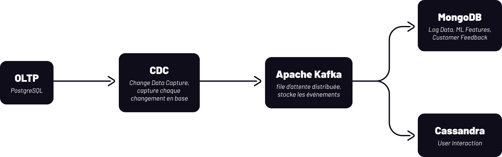
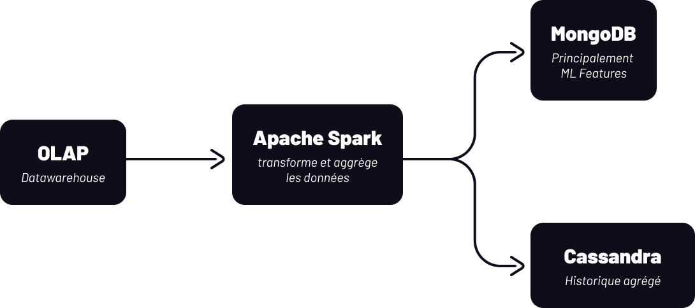

# 4. Modèle de données NoSQL

# Pourquoi le NoSQL

Stripe traitent des milliards de transactions par jour et collecte des données très diversifiées : des logs système, des interactions utilisateur, des données machine learning, et du feedback client. Ces données sont pour la plupart semi-structurées ou non structurées, avec des formats qui varient considérablement d'une source à l'autre.

Une base relationnelle classique impose un schéma rigide défini à l'avance. Dans notre contexte, chaque type de log a un format différent, chaque modèle ML utilise des features distinctes, et le feedback client est du texte libre. Un schéma fixe ne peut pas s'adapter à cette diversité sans créer une complexité de maintenance très importante.

De plus, certains de nos workloads, notamment le clickstream utilisateur, génèrent un volume d'écriture extrême en temps réel. Les bases relationnelles ne sont pas conçues pour ce type de charge.

# Choix des types de bases NoSQL

Pour répondre aux besoins de Stripe en matière de gestion de données non structurées et semi-structurées à très haute volumétrie, nous proposons une architecture NoSQL combinant deux technologies complémentaires :

- MongoDB: base de données orientés documents
- Cassandra: base de données orientés colonnes

| Collection | Type NoSQL | Technologie | Raison principale |
| --- | --- | --- | --- |
| Log Data | Document Store | MongoDB | Schéma variable, données imbriquées |
| User Interaction | Column-Family | Cassandra | Écriture massive, latence constante |
| ML Features | Document Store | MongoDB | Flexibilité schema, features variées par modèle |
| Customer Feedback | Document Store | MongoDB | Texte libre, structure hétérogène |

## Log `Document Store`

Les logs de Stripe sont semi-structurés en JSON, mais leur format varie selon le type de log. Un error log n'a pas les mêmes champs qu'un access log. Le Document Store permet de stocker chaque log comme un document independant sans contrainte de schéma uniforme. On peut aussi requêter sur des champs imbriqués, ce qui est essentiel pour filtrer des logs par niveau d'erreur, par timestamp, ou par merchant.

### Exemple

**Scénario 1 — Paiement accepté**

```json
{
  "_id": "LOG001",
  "event_ts": "2026-01-15T09:13:20Z",
  "event_type": "ACCESS_LOG",
  "level": "INFO",
  "service": "checkout-api",
  "message": "Checkout payment request received",
  "request_id": "req_8b21",
  "transaction_id": "TX100",
  "invoice_id": "IV42",
  "customer_id": "C01",
  "merchant_id": "M01",
  "ip": "192.168.1.10",
  "http": {
    "method": "POST",
    "path": "/checkout/pay",
    "status_code": 200,
    "latency_ms": 128
  },
  "device": {
    "device_id": "D001",
    "device_type": "DESKTOP",
    "os": "APPLE",
    "browser": "CHROME",
    "is_emulator": false
  },
  "payment_info": {
    "currency": "EUR",
    "amount": 336.00
  }
}
```

**Scénario 2 — Fraude détectée**

```json
{
  "_id": "LOG005",
  "event_ts": "2026-01-15T14:47:06Z",
  "event_type": "FRAUD_CHECK",
  "level": "WARNING",
  "service": "fraud-service",
  "message": "Fraud assessment completed — risk level HIGH",
  "request_id": "req_4c77",
  "transaction_id": "TX200",
  "customer_id": "C05",
  "merchant_id": "M03",
  "http": {
    "method": "POST",
    "path": "/fraud/assess",
    "status_code": 200,
    "latency_ms": 52
  },
  "fraud_assessment": {
    "fraud_assessment_id": "FRA419",
    "model_name": "FRAUD_DETECTION_001",
    "model_version": "1.1",
    "fraud_score": 87.3,
    "risk_level": "HIGH",
    "decision": "BLOCKED",
    "signals": [
      { "name": "IS_EMULATOR", "value": true },
      { "name": "GEO_DISTANCE_KM", "value": 1842.5 },
      { "name": "FAILED_ATTEMPTS_1H", "value": 4 },
      { "name": "UNUSUAL_HOUR", "value": false },
      { "name": "IP_BLACKLISTED", "value": true },
      { "name": "AMOUNT_ABOVE_THRESHOLD", "value": true }
    ]
  }
}
```

### Exemples de requêtes

**Retrouver tous les logs d'une transaction**

Permet de retracer l'ensemble du flow d'une transaction, du checkout à la confirmation ou au blocage.

```jsx
db.logs.find({
  transaction_id: "TX100"
}).sort({ event_ts: 1 })
```

**Retrouver tous les erreurs d'un marchant sur les 24 dernières heures**

Permet de surveiller la santé d'un merchant en temps réel.

```jsx
db.logs.find({
  merchant_id: "M01",
  level: "ERROR",
  event_ts: {
    $gte: ISODate("2026-01-14T09:00:00Z"),
    $lte: ISODate("2026-01-15T09:00:00Z")
  }
}).sort({ event_ts: -1 })
```

**Retrouver les logs avec une latence supérieure à 500ms**

Permet d'identifier les points de goulot en performance.

```jsx
db.logs.find({
  "http.latency_ms": { $gt: 500 }
}).sort({ "http.latency_ms": -1 })
```

## User Interaction `Column-Family`

Le clickstream et les données de session représentent un volume d'écriture massif en temps réel. Chaque seconde, des millions de marchant et de consommateurs génèrent des clics, des scrolls, des navigations. Les requêtes sont toujours centrées sur un identifiant utilisateur ou de session, sur une plage temporelle.

Le Column-Family organise les données avec une partition key (user_id) et une clustering key (timestamp). Toutes les actions d'un même utilisateur sont physiquement regroupées et triées par temps sur le même noeud. La requête ne lit exactement que ce qu'elle a besoin, avec une latence constante même sous charge extrême.

### Exemple

**Scénario 1 — Un client effectue un paiement sur un site marchand**

Données :

Partition Key → user_id: C01
Clustering Key → timestamp (ASC)

| user_id | timestamp | session_id | action | page | element | http_status | latency_ms | metadata |
| --- | --- | --- | --- | --- | --- | --- | --- | --- |
| C01 | 2026-01-15T09:12:50Z | sess_A1 | CLICK | /products | btn_add_to_cart | 200 | 112 | { product_id: P42, amount: 336.00 } |
| C01 | 2026-01-15T09:12:52Z | sess_A1 | SCROLL | /products | page_body | — | — | { scroll_depth_pct: 45 } |
| C01 | 2026-01-15T09:12:55Z | sess_A1 | CLICK | /products | btn_view_cart | 200 | 88 | {} |
| C01 | 2026-01-15T09:12:57Z | sess_A1 | PAGE_VIEW | /cart | — | 200 | 145 | { nb_items: 1 } |
| C01 | 2026-01-15T09:13:05Z | sess_A1 | CLICK | /cart | btn_checkout | 200 | 102 | {} |
| C01 | 2026-01-15T09:13:08Z | sess_A1 | PAGE_VIEW | /checkout | — | 200 | 210 | {} |
| C01 | 2026-01-15T09:13:10Z | sess_A1 | TYPE | /checkout | input_email | — | — | { field: email } |
| C01 | 2026-01-15T09:13:14Z | sess_A1 | TYPE | /checkout | input_card_number | — | — | { field: card_number } |
| C01 | 2026-01-15T09:13:18Z | sess_A1 | CLICK | /checkout | btn_pay | 200 | 128 | { amount: 336.00, currency: EUR } |
| C01 | 2026-01-15T09:13:22Z | sess_A1 | PAGE_VIEW | /confirmation | — | 200 | 95 | { transaction_id: TX100, status: SUCCESS } |

Session metadata (table séparée) 

| session_id | user_id | started_at | ended_at | device_type | os | browser | ip |
| --- | --- | --- | --- | --- | --- | --- | --- |
| sess_A1 | C01 | 2026-01-15T09:12:50Z | 2026-01-15T09:13:22Z | DESKTOP | APPLE | CHROME | 192.168.1.10 |

**Scénario 2 — Un merchant configure son dashboard Stripe**

Données :

Partition Key → user_id: M03
Clustering Key → timestamp (ASC)

| user_id | timestamp | session_id | action | page | element | http_status | latency_ms | metadata |
| --- | --- | --- | --- | --- | --- | --- | --- | --- |
| M03 | 2026-01-15T10:05:12Z | sess_B7 | PAGE_VIEW | /dashboard | — | 200 | 180 | {} |
| M03 | 2026-01-15T10:05:15Z | sess_B7 | CLICK | /dashboard | nav_payments | 200 | 134 | {} |
| M03 | 2026-01-15T10:05:16Z | sess_B7 | PAGE_VIEW | /dashboard/payments | — | 200 | 220 | { nb_transactions: 142 } |
| M03 | 2026-01-15T10:05:20Z | sess_B7 | SCROLL | /dashboard/payments | page_body | — | — | { scroll_depth_pct: 72 } |
| M03 | 2026-01-15T10:05:25Z | sess_B7 | CLICK | /dashboard/payments | filter_date_range | — | — | { range: last_7_days } |
| M03 | 2026-01-15T10:05:26Z | sess_B7 | PAGE_VIEW | /dashboard/payments | — | 200 | 310 | { nb_transactions: 38, filtered: true } |
| M03 | 2026-01-15T10:05:30Z | sess_B7 | CLICK | /dashboard/payments | nav_settings | 200 | 98 | {} |
| M03 | 2026-01-15T10:05:31Z | sess_B7 | PAGE_VIEW | /dashboard/settings | — | 200 | 155 | {} |
| M03 | 2026-01-15T10:05:40Z | sess_B7 | CLICK | /dashboard/settings | tab_webhooks | 200 | 112 | {} |
| M03 | 2026-01-15T10:05:42Z | sess_B7 | PAGE_VIEW | /dashboard/webhooks | — | 200 | 190 | { nb_endpoints: 3 } |
| M03 | 2026-01-15T10:05:50Z | sess_B7 | CLICK | /dashboard/webhooks | btn_add_endpoint | 200 | 88 | {} |
| M03 | 2026-01-15T10:06:05Z | sess_B7 | TYPE | /dashboard/webhooks | input_url | — | — | { field: webhook_url } |
| M03 | 2026-01-15T10:06:10Z | sess_B7 | CLICK | /dashboard/webhooks | btn_save | 201 | 245 | { endpoint_id: WH_091, status: CREATED } |
| M03 | 2026-01-15T10:06:12Z | sess_B7 | PAGE_VIEW | /dashboard/webhooks | — | 200 | 160 | { nb_endpoints: 4 } |

Session metadata (table séparée) 

| session_id | user_id | started_at | ended_at | device_type | os | browser | ip |
| --- | --- | --- | --- | --- | --- | --- | --- |
| sess_B7 | M03 | 2026-01-15T10:05:12Z | 2026-01-15T10:06:12Z | DESKTOP | WINDOWS | FIREFOX | 10.0.0.54 |

### Pourquoi deux tables

**`user_interactions`** → une ligne par action, volume massif, écriture constante. C'est le coeur du Column-Family.

**`session metadata`** — les infos device, IP, browser ne changent pas pendant une session. Les dupliquer sur chaque ligne serait une redondance inutile à l'échelle de Stripe. On les stocke une seule fois, liées par `session_id`.

### **Explications du choix**

Dans notre architecture, les données d'interaction utilisateur et les métadonnées de session sont liées par le `session_id`, mais elles ont des cycles de vie très différents. Les interactions sont écrites en continu, à haute fréquence, pendant toute la durée de la session. Les métadonnées de session, quant à elles, sont définies une seule fois à l'ouverture de la session et ne changent jamais : le device, le navigateur, l'IP restent constants.

Si nous avions choisi l'embedding, ces informations auraient été dupliquées sur chaque ligne d'interaction. À l'échelle de Stripe, une session moyenne génère des dizaines d'actions. Stocker le device, l'OS, le navigateur sur chaque ligne représente une redondance massive qui impacte directement la consommation de stockage et les performances d'écriture.

La denormalization aurait présenté le même problème de redondance, avec en plus une complexité de maintenance supplémentaire : si une information de session devait être corrigée, il faudrait la mettre à jour sur toutes les lignes concernées simultanément.

Le referencing permet donc de stocker les métadonnées de session une seule fois dans une table dédiée, et de les référencer via le `session_id` depuis `user_interactions`. Le lien est géré côté application lors de la lecture, ce qui est acceptable dans notre contexte puisque les données de session sont stables et préchargées en mémoire pour la durée de la session. C'est le meilleure compromis entre performance d'écriture, consommation de stockage, et cohérence des données.

### Exemples de requêtes

**Retrouver toutes les actions d'un utilisateur sur une plage temporelle**

La requête la plus fréquente. Elle exploite directement la partition key + clustering key.

```sql
SELECT *
FROM user_interactions
WHERE user_id = 'C01'
  AND timestamp >= '2026-01-15T09:12:50Z'
  AND timestamp <= '2026-01-15T09:13:22Z';
```

**Retrouver les dernières actions d'un utilisateur**

Utilisée pour afficher l'historique récent d'un utilisateur dans le dashboard.

```sql
SELECT *
FROM user_interactions
WHERE user_id = 'C01'
ORDER BY timestamp DESC
LIMIT 10;
```

**Retrouver toutes les actions sur une page spécifique**

Utilisée pour analyser le comportement sur une page précise.

```sql
SELECT *
FROM user_interactions
WHERE user_id = 'C01'
  AND timestamp >= '2026-01-15T09:00:00Z'
  AND page = '/checkout';
```

## ML Features `Document Store`

Chaque modèle ML utilisé par Stripe a des features complètement différentes en structure. Un modèle de détection de fraude n'utilise pas les mêmes données qu'un modèle de personnalisation. Le Document Store permet de stocker ces features avec un schéma flexible par modèle, de faire des updates partiels sur un seul champ sans réécrire tout le document, et de gérer des données imbriquées complexes.

## Exemple

**Scénario 1 — Modèle de détection de fraude**

```json
{
  "_id": "MLF_FR_001",
  "user_id": "C01",
  "merchant_id": "M01",
  "model": {
    "model_id": "FRAUD_DETECTION_001",
    "model_name": "Fraud Detection",
    "model_version": "1.1",
    "environment": "PRODUCTION"
  },
  "generated_at": "2026-01-15T09:13:21Z",
  "ttl_expires_at": "2026-01-16T09:13:21Z",
  "transaction_context": {
    "transaction_id": "TX100",
    "amount": 336.00,
    "currency": "EUR",
    "payment_method": "VISA",
    "payment_method_id": "PM01",
    "last_four": "4242"
  },
  "device_signals": {
    "device_id": "D001",
    "device_type": "DESKTOP",
    "os": "APPLE",
    "browser": "CHROME",
    "is_emulator": false,
    "fingerprint_hash": "fp_a3b7e2c9"
  },
  "geolocation_signals": {
    "ip_address": "192.168.1.10",
    "ip_country": "FR",
    "ip_city": "Paris",
    "customer_registered_country": "FR",
    "geo_distance_km": 2.1,
    "is_vpn": false,
    "is_tor": false
  },
  "behavioral_signals": {
    "failed_attempts_last_1h": 0,
    "failed_attempts_last_24h": 0,
    "successful_transactions_last_7d": 4,
    "avg_transaction_amount_last_30d": 287.50,
    "amount_deviation_score": 0.17,
    "unusual_hour": false,
    "time_since_last_transaction_hours": 18.3,
    "session_duration_before_payment_s": 32
  },
  "historical_signals": {
    "account_age_days": 245,
    "total_transactions_lifetime": 41,
    "total_amount_lifetime": 11782.00,
    "fraud_flags_lifetime": 0,
    "chargebacks_lifetime": 0
  },
  "output": {
    "fraud_score": 12.4,
    "risk_level": "LOW",
    "decision": "APPROVED",
    "confidence": 0.94
  }
}
```

**Scénario 2 — Modèle de personnalisation client**

```json
{
  "_id": "MLF_PS_001",
  "user_id": "C01",
  "merchant_id": "M01",
  "model": {
    "model_id": "PERSONALIZATION_001",
    "model_name": "Customer Personalization",
    "model_version": "2.3",
    "environment": "PRODUCTION"
  },
  "generated_at": "2026-01-15T09:14:00Z",
  "ttl_expires_at": "2026-01-22T09:14:00Z",
  "demographic_profile": {
    "customer_id": "C01",
    "account_created_at": "2025-05-15T12:00:00Z",
    "preferred_currency": "EUR",
    "language": "FR",
    "timezone": "Europe/Paris"
  },
  "purchase_behavior": {
    "total_transactions_lifetime": 41,
    "avg_transaction_amount": 287.50,
    "median_transaction_amount": 265.00,
    "max_transaction_amount": 1200.00,
    "min_transaction_amount": 15.00,
    "transactions_last_7d": 2,
    "transactions_last_30d": 8,
    "transactions_last_90d": 22,
    "preferred_payment_methods": [
      { "method": "VISA", "usage_pct": 72 },
      { "method": "PAYPAL", "usage_pct": 28 }
    ]
  },
  "category_interests": [
    { "category": "ELECTRONICS", "score": 0.87, "last_purchase_at": "2026-01-10T14:22:00Z" },
    { "category": "CLOTHING", "score": 0.64, "last_purchase_at": "2025-12-28T09:45:00Z" },
    { "category": "TRAVEL", "score": 0.41, "last_purchase_at": "2025-11-02T18:10:00Z" }
  ],
  "engagement_signals": {
    "avg_session_duration_s": 185,
    "avg_pages_per_session": 4.2,
    "click_through_rate": 0.23,
    "last_active_at": "2026-01-15T09:13:22Z",
    "churn_risk_score": 0.12,
    "preferred_time_of_day": "MORNING",
    "preferred_day_of_week": "MONDAY"
  },
  "merchant_affinity": [
    { "merchant_id": "M01", "visits": 14, "purchases": 8, "affinity_score": 0.91 },
    { "merchant_id": "M07", "visits": 9, "purchases": 3, "affinity_score": 0.54 },
    { "merchant_id": "M12", "visits": 5, "purchases": 1, "affinity_score": 0.32 }
  ],
  "output": {
    "customer_segment": "HIGH_VALUE_LOYAL",
    "recommended_merchants": ["M01", "M15", "M23"],
    "recommended_categories": ["ELECTRONICS", "CLOTHING"],
    "optimal_offer_timing": "MONDAY_MORNING",
    "lifetime_value_estimate": 8750.00,
    "confidence": 0.88
  }
}
```

### Exemples de requêtes

**Retrouver les features d'un utilisateur pour un modèle spécifique**

Utilisée lors de l'inference en temps réel pour récupérer les features d'un client.

```jsx
db.ml_features.find({
  user_id: "C01",
  "model.model_id": "FRAUD_DETECTION_001"
})
```

**Mettre à jour un seul champ sans réécrire le document**

Permet de mettre à jour les features en temps réel après un nouvel événement sans toucher au reste du document.

```jsx
db.ml_features.updateOne(
  { user_id: "C01", "model.model_id": "FRAUD_DETECTION_001" },
  { $set: {
    "behavioral_signals.failed_attempts_last_1h": 2,
    "output.fraud_score": 34.7,
    "output.risk_level": "MEDIUM"
  }}
)
```

**Retrouver tous les utilisateurs avec un score de fraude élevé**

Permet à l'équipe fraude de surveiller les décisions de blocage.

```jsx
db.ml_features.find({
  "model.model_id": "FRAUD_DETECTION_001",
  "output.fraud_score": { $gte: 70 },
  "output.decision": "BLOCKED"
}).sort({ "output.fraud_score": -1 })
```

## Customer Feedback `Document Store`

Le feedback client est du texte libre avec une structure variable. Une review n'a pas les mêmes champs qu'une réponse à un sondage. Le Document Store gère naturellement cette hétérogénéité et permet de stocker chaque entrée comme un document autonome.

## Exemple

**Scénario 1 — Review après un paiement**

```json
{
  "_id": "FB_001",
  "feedback_id": "FB_001",
  "user_id": "C01",
  "merchant_id": "M01",
  "type": "REVIEW",
  "created_at": "2026-01-15T09:45:00Z",
  "updated_at": "2026-01-15T09:45:00Z",
  "transaction_context": {
    "transaction_id": "TX100",
    "product_id": "P42",
    "amount": 336.00,
    "currency": "EUR",
    "transaction_date": "2026-01-15T09:13:22Z"
  },
  "content": {
    "title": "Paiement rapide mais interface confuse",
    "body": "Le paiement a été traité très rapidement, moins de 5 secondes. En revanche, la page de confirmation n'est pas très claire, j'ai mis du temps à comprendre que le paiement avait bien abouti. J'aurais préféré un message plus visible.",
    "language": "FR",
    "word_count": 52
  },
  "ratings": {
    "overall": 3,
    "speed": 5,
    "interface": 2,
    "security": 4,
    "scale": "1_TO_5"
  },
  "sentiment_analysis": {
    "overall_score": 0.42,
    "label": "MIXED",
    "positive_aspects": ["vitesse_paiement", "fiabilité"],
    "negative_aspects": ["clarté_confirmation", "interface_utilisateur"],
    "confidence": 0.87
  },
  "tags": ["PAIEMENT", "INTERFACE", "CONFIRMATION"],
  "device": {
    "device_type": "DESKTOP",
    "os": "APPLE",
    "browser": "CHROME"
  },
  "moderation": {
    "status": "APPROVED",
    "moderated_at": "2026-01-15T10:00:00Z",
    "flags": []
  }
}
```

**Scénario 2 — Réponse à un sondage post-incident**

```json
{
  "_id": "FB_002",
  "feedback_id": "FB_002",
  "user_id": "C05",
  "merchant_id": "M03",
  "type": "SURVEY",
  "created_at": "2026-01-15T15:30:00Z",
  "updated_at": "2026-01-15T15:30:00Z",
  "survey_context": {
    "survey_id": "SRV_INC_042",
    "survey_name": "Post-Incident Customer Experience",
    "survey_trigger": "INCIDENT",
    "incident_id": "INC_2026_0115",
    "incident_type": "PAYMENT_FAILURE",
    "incident_date": "2026-01-15T14:47:05Z"
  },
  "content": {
    "language": "FR",
    "questions": [
      {
        "question_id": "Q01",
        "question_text": "Avez-vous été informé de l'incident en temps réel ?",
        "answer_type": "SINGLE_CHOICE",
        "answer": "NON",
        "options": ["OUI", "PARTIELLEMENT", "NON"]
      },
      {
        "question_id": "Q02",
        "question_text": "À quelle point êtes-vous satisfait de la façon dont l'incident a été géré ?",
        "answer_type": "SCALE",
        "answer": 2,
        "scale_min": 1,
        "scale_max": 5
      },
      {
        "question_id": "Q03",
        "question_text": "Combien de temps a-t-il fallu pour résoudre votre problème ?",
        "answer_type": "SINGLE_CHOICE",
        "answer": "PLUS_DE_24H",
        "options": ["MOINS_DE_1H", "1H_A_6H", "6H_A_24H", "PLUS_DE_24H"]
      },
      {
        "question_id": "Q04",
        "question_text": "Avez-vous des commentaires supplémentaires ?",
        "answer_type": "OPEN_TEXT",
        "answer": "Très décevant. Mon paiement a été bloqué sans explication claire. J'ai dû contacter le support manuellement pour savoir ce qui s'est passé. Un message automatique aurait été vraiment utile."
      }
    ]
  },
  "sentiment_analysis": {
    "overall_score": -0.68,
    "label": "NEGATIVE",
    "positive_aspects": [],
    "negative_aspects": ["communication_incident", "délai_résolution", "manque_information"],
    "confidence": 0.91
  },
  "tags": ["INCIDENT", "COMMUNICATION", "SUPPORT", "PAIEMENT_BLOQUÉ"],
  "device": {
    "device_type": "MOBILE",
    "os": "IOS",
    "browser": "SAFARI"
  },
  "moderation": {
    "status": "APPROVED",
    "moderated_at": "2026-01-15T16:00:00Z",
    "flags": []
  }
}
```

### Exemples de requêtes

**Retrouver tout le feedback d'un marchant**

Permet à un merchant de suivre les retours de ses clients.

```jsx
db.customer_feedback.find({
  merchant_id: "M01"
}).sort({ created_at: -1 })
```

**Retrouver les feedbacks négatifs sur une période**

Permet à l'équipe support de prioriser les clients insatisfaits.

```jsx
db.customer_feedback.find({
  "sentiment_analysis.label": "NEGATIVE",
  created_at: {
    $gte: ISODate("2026-01-01T00:00:00Z"),
    $lte: ISODate("2026-01-31T23:59:59Z")
  }
}).sort({ "sentiment_analysis.overall_score": 1 })
```

**Calculer la moyenne des ratings par merchant**

Permet de générer un tableau de bord de qualité pour chaque merchant.

```jsx
db.customer_feedback.aggregate([
  { $match: {
    merchant_id: "M01",
    type: "REVIEW"
  }},
  { $group: {
    _id: "$merchant_id",
    avg_overall: { $avg: "$ratings.overall" },
    avg_speed: { $avg: "$ratings.speed" },
    avg_interface: { $avg: "$ratings.interface" },
    total_reviews: { $sum: 1 }
  }}
])
```

# **Technologies choisies**

## **Document Store — MongoDB**

### **Choix**

MongoDB a été retenu comme technologie pour les trois collections de type Document Store : Log Data, ML Features et Customer Feedback.

### Pourquoi ?

Ces trois collections partagent un besoin fondamental de flexibilité du schéma. Les logs ont des formats différents selon leur type, les features ML varient en structure selon chaque modèle, et le feedback client présente des contenus hétérogènes selon qu'il s'agit d'une review ou d'un sondage. Une base relationnelle ou un autre type de NoSQL ne pourrait pas accueillir ces données sans créer une complexité de modélisation très importante. MongoDB permet de stocker chaque document de façon autonome, avec un schéma qui s'adapte à chaque cas sans contrainte préalable.

### **Points fort**

MongoDB stocke nativement du JSON, ce qui correspond exactement au format de nos données. Il supporte les requêtes sur des champs imbriqués, permettant par exemple de filtrer les logs par niveau d'erreur dans un objet imbriqué, ou de requêter une feature spécifique dans un document ML. Il supporte les updates partiels, permettant de modifier un seul champ sans réécrire l'ensemble du document, ce qui est essentiel pour la mise à jour régulière. 

### Performances

MongoDB optimise ses lectures via ses index. On peut indexer sur des champs imbriqués, ce qui est critique dans notre contexte. Par exemple, on peut indexer sur `transaction_id` dans les logs pour retrouver tous les événements liés à une transaction en millisecondes, ou sur `model.model_id` dans les ML Features pour isoler rapidement les features d'un modèle spécifique. Il supporte aussi les requêtes sur plusieurs champs simultanément via des index composés, comme filtrer les logs par `merchant_id` et `event_ts` en même temps.

## Scalabilité

MongoDB scale horizontalement via le **sharding**. Les données sont distribuées sur plusieurs noeuds selon une clé de shard choisie par nous. Dans notre cas, on shard principalement sur `user_id` ou `merchant_id`, ce qui garantit que toutes les données d'un même utilisateur restent regroupées sur le même noeud. Quand le volume croît, on ajoute simplement des noeuds au cluster. MongoDB redistribue automatiquement les données.

## **Column-Family — Cassandra**

### Choix

Cassandra a été retenu comme technologie pour la collection User Interaction Data.

### Pourquoi ?

Le clickstream et les données de session représentent un workload complètement différent des trois autres collections. On parle d'écritures massives, en continu, en temps réel, à très haute fréquence. Chaque seconde, des millions de marchants ou de consommateurs génèrent des interactions. Les requêtes sont toujours centrées sur un identifiant utilisateur sur une plage temporelle donnée. Ce pattern d'accès est exactement celui pour lequel le Column-Family a été conçu.

### **Points fort**

Le modèle partition key et clustering key de Cassandra permet de regrouper physiquement toutes les interactions d'un même utilisateur sur le même noeud, triées par timestamp. La requête ne lit donc que ce qu'elle a besoin, sans parcourir des données irrelevantes. Sa latence P99 reste constante même sous une charge extrême, ce qui est critique pour un système temps réel. Son architecture peer-to-peer élimine tout point de défaillance unique, garantissant une haute disponibilité en permanence.

### Performances

Cassandra est conçu pour minimiser le temps d'écriture. Il écrit d'abord dans un **memtable** en mémoire, puis flush vers le disque par lots. Cette approche garantit une latence d'écriture constante même sous charge massive. Les lectures sont aussi optimisées par le clustering key : les données sont physiquement triées par timestamp sur le disque, donc une requête sur une plage temporelle ne lit que le segment nécessaire sans parcourir le reste.

### Scalabilité

Cassandra scale horizontalement de façon native via un système de **consistent hashing**. Chaque noeud est responsable d'un segment de données déterminé par le hash de la partition key. Quand on ajoute un noeud, Cassandra répartit automatiquement les données sans interruption de service.

## **Complémentarité des deux technologies**

Ces deux technologies ne font jamais la même chose. MongoDB gère la complexité et la diversité des données. Cassandra gère la performance en écriture et la scalabilité sous charge. Elles sont utilisées chacune uniquement sur leur périmètre de force, sans chevauchement, ce qui garantit une architecture stable et performante à l'échelle de Stripe.

## **Impact financier des choix technologiques**

Le choix de nos technologies NoSQL a été guidé non seulement par les besoins techniques, mais également par leur impact sur les coûts de production. MongoDB et Cassandra sont tous deux open source, ce qui élimine les coûts de licence enterprise associés à des solutions propriétaires. 

En regroupant trois collections sur un seul cluster MongoDB, nous réduisons considérablement le nombre d'instances à maintenir, ce qui impacte directement les coûts d'infrastructure cloud (CPU, RAM, stockage) et les coûts humains liés à la supervision et à la maintenance. 

Cassandra, de sa part, a été retenu uniquement pour la collection User Interaction Data, parce que c'est le seul workload qui justifie son coût d'exploitation. Son architecture peer-to-peer garantit une haute disponibilité sans nécessiter de mécanismes externes de redondance, ce qui évite de devoir dimensionner des systèmes de backup supplémentaires. 

À l'échelle de Stripe, où chaque minute d'indisponibilité représente des millions de transactions bloquées, investir dans Cassandra sur ce périmètre précis représente un retour sur investissement direct. Si nous avions utilisé quatre technologies différentes, nous aurions multiplié les coûts d'infrastructure, de formation des équipes, et de supervision, sans valeur ajoutée significative sur les workloads qui ne le justifient pas. Notre approche de deux technologies, chacune utilisée uniquement sur son périmètre de force, représente donc le meilleur compromis entre performance, disponibilité, et maîtrise des coûts à l'échelle.

# OLTP vers NoSQL

L'OLTP génère des événements en continu : une transaction se fait, un paiement échoue, un client se connecte. Ces événements doivent arriver rapidement dans nos bases NoSQL (le temps réel).



### Comment ça marche

Le CDC surveille les changements dans la base OLTP en temps réel. Chaque changement est publié comme un événement dans Kafka. Kafka stocke ces événements et les distribue aux consommateurs (MongoDB et Cassandra) selon leur besoin. Chaque base consomme uniquement les événements qui lui sont destinés.

C'est ce pattern que les entreprises comme Stripe utilisent en production parce qu'il garantit qu'aucun événement n'est perdu, même si une base NoSQL est temporairement indisponible. Kafka fait tampon.

# OLAP vers NoSQL

L'OLAP contient des données analytiques déjà traitées : des agrégations, des scores calculés, des features ML entraînées. Ces données ne changent pas en temps réel, elles sont produites par des pipelines de transformation.



### Comment ça marche

Spark lit les données depuis l'OLAP, les transforme selon les besoins du modèle ML ou de l'analyse, puis les écrit dans MongoDB. Ce flux est batch — il tourne selon un planning (toutes les heures, une fois par jour) plutôt qu'en temps réel.