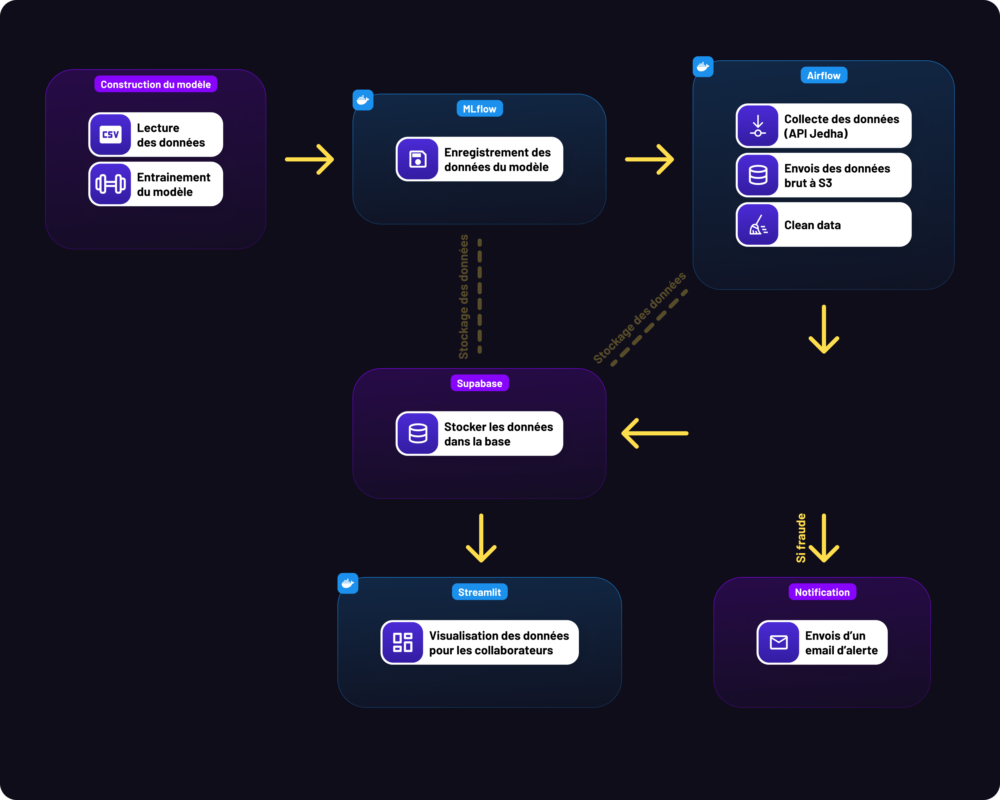

# Architecture — Système de détection de fraude en temps réel

## Vue d'ensemble

Ce projet implémente un pipeline complet de détection de fraude bancaire en temps réel, de la collecte des données jusqu'à l'alerte des équipes métier. L'architecture suit le principe de **séparation des responsabilités** : chaque service a un rôle unique et bien délimité, ce qui facilite la maintenance, les tests et la scalabilité.

Le système est entièrement containerisé avec Docker et orchestré via Docker Compose. Il intègre six services indépendants qui communiquent entre eux via des API REST et une base de données partagée.

---

## Diagramme d'architecture


---

## Description des services

### 1. Apache Airflow — Orchestrateur central

**Rôle :** Airflow est le chef d'orchestre du pipeline temps réel. Il exécute le DAG `fraud_detection_realtime` toutes les minutes et coordonne l'ensemble des opérations dans un ordre défini.

**Pourquoi Airflow ?**
- Airflow est le standard industrie pour l'orchestration de pipelines de données. Il offre une interface visuelle pour monitorer les exécutions, relancer des tâches en échec, et historiser les logs.
- Par rapport à un simple `cron`, Airflow apporte la gestion des dépendances entre tâches, la reprise sur erreur, et la traçabilité complète de chaque exécution.
- L'architecture `LocalExecutor` avec PostgreSQL comme backend est adaptée à un projet single-node tout en restant extensible vers `CeleryExecutor` pour du multi-workers.

**Séquence du DAG (toutes les minutes) :**
```
1. GET  → Jedha API        (récupération de la transaction courante)
2. PUT  → AWS S3            (archivage du JSON brut horodaté)
3. CALL → clean_datas()     (feature engineering)
4. POST → FastAPI /predict  (prédiction du modèle)
5. SQL  → Supabase          (persistance transaction + prédiction)
6. SMTP → Email             (alerte si is_fraud = True)
```

---

### 2. FastAPI — Service de prédiction

**Rôle :** Exposer le modèle ML via une API REST. FastAPI reçoit une transaction nettoyée, charge le modèle depuis MLflow et retourne un score de fraude.

**Pourquoi FastAPI ?**
- FastAPI est basé sur Python (cohérent avec l'écosystème ML) et offre des performances comparables à Node.js grâce à son moteur asynchrone (Starlette + Uvicorn).
- La validation automatique des données via **Pydantic** garantit que toute transaction mal formée est rejetée proprement (code 422) avant d'atteindre le modèle.
- La documentation Swagger est générée automatiquement, facilitant les tests et l'intégration.
- Séparation claire entre la logique métier (routes), les modèles de données (Pydantic) et l'inférence (utils).

**Optimisation clé — cache du modèle :**
Le modèle XGBoost/RandomForest est chargé **une seule fois** au démarrage et mis en cache en mémoire via une variable globale `_pipeline`. Cela évite un aller-retour MLflow à chaque prédiction, réduisant le temps d'inférence à ~15ms.

```python
# Chargé une fois, réutilisé à chaque requête
_pipeline = None

def get_pipeline():
    global _pipeline
    if _pipeline is not None:
        return _pipeline
    # Charge le run avec le meilleur F1 depuis MLflow
    _pipeline = joblib.load(mlflow.artifacts.download_artifacts(...))
    return _pipeline
```

**Endpoints :**
| Méthode | Route | Description |
|---------|-------|-------------|
| POST | `/predict` | Prédiction de fraude (retourne score, probabilité, run_id, temps d'inférence) |
| GET | `/health` | Vérification de santé du service |

---

### 3. MLflow — Tracking et registry des modèles

**Rôle :** Tracer toutes les expériences d'entraînement (paramètres, métriques, artifacts) et servir de source de vérité pour le modèle en production.

**Pourquoi MLflow ?**
- MLflow permet de comparer objectivement plusieurs runs (RandomForest vs XGBoost, différents hyperparamètres) et de sélectionner automatiquement le meilleur modèle selon une métrique cible (ici : **F1-score**, privilégié sur l'accuracy car le dataset est très déséquilibré — 0.58% de fraudes).
- Le modèle en production est toujours le **meilleur run disponible**, sélectionné dynamiquement par FastAPI au démarrage :
  ```python
  runs = client.search_runs(order_by=["metrics.f1 DESC"], max_results=1)
  ```
- Les artifacts (fichier `.pkl`) sont stockés dans **AWS S3**, ce qui découple le stockage du service MLflow et garantit la persistance des modèles même en cas de redémarrage du container.

**Métriques loggées :**
| Métrique | Justification |
|----------|---------------|
| F1-score | Métrique principale — équilibre précision/rappel sur données déséquilibrées |
| Recall | Prioritaire : minimiser les fraudes non détectées (faux négatifs) |
| Precision | Contrôle : éviter trop de fausses alertes (faux positifs) |
| ROC-AUC | Évalue la capacité de discrimination globale du modèle |

---

### 4. Modèle ML — RandomForestClassifier

**Pourquoi RandomForest ?**
- **Robustesse** : le RandomForest est peu sensible aux outliers et gère nativement les variables mixtes (numériques + catégorielles après encodage).
- **Interprétabilité** : les `feature_importances_` permettent d'expliquer les décisions au jury et aux équipes métier.
- **`class_weight="balanced"`** : compense automatiquement le déséquilibre fort des classes (1:172 — une fraude pour 172 transactions légitimes) en pondérant les erreurs sur la classe minoritaire.
- Le XGBoost a été exploré dans `xgboost_optimisation.ipynb` comme alternative, mais le RandomForest a démontré un meilleur rappel sur la fraude dans nos expériences.

**Feature engineering (`clean_datas.py`) :**

| Feature construite | Source | Justification |
|-------------------|--------|---------------|
| `age` | `dob` | L'EDA montre que les personnes âgées (65+) sont légèrement plus ciblées |
| `distance_km` | `lat/long` vs `merch_lat/merch_long` | Distance géodésique réelle entre porteur et marchand (geopy) |
| `trans_hour` | `trans_date_trans_time` | L'EDA révèle un pic de fraude entre 22h et 4h |
| `trans_day` | `trans_date_trans_time` | Capture les patterns hebdomadaires |
| `trans_month` | `trans_date_trans_time` | Capture les patterns saisonniers |
| `customer_job_category` | `job` | Réduit 494 métiers uniques en 16 catégories stables (évite l'explosion dimensionnelle du OneHotEncoder) |

**Pipeline sklearn :**
```
ColumnTransformer
├── StandardScaler         → variables numériques (amt, age, distance_km, city_pop, ...)
└── OneHotEncoder          → variables catégorielles (category, gender, state, customer_job_category)
        │
        ▼
RandomForestClassifier(n_estimators=100, max_depth=20, class_weight="balanced")
```

---

### 5. Supabase (PostgreSQL) — Base de données

**Rôle :** Stocker de façon structurée et relationnelle toutes les données du pipeline : transactions, prédictions, alertes et versions de modèle.

**Pourquoi Supabase ?**
- Supabase est un **PostgreSQL managé** : pas de serveur à administrer, haute disponibilité, backups automatiques.
- L'interface Supabase facilite l'exploration des données et la gestion des accès.
- Trois schémas isolés dans la même base permettent de séparer les données métier (`public`), les métadonnées Airflow (`airflow`) et les métadonnées MLflow (`mlflow`) sans multiplier les connexions.

**Schéma relationnel `public` :**

```
cardholders ──┐
              ├──► transactions ──► predictions ──► alerts
merchants ────┘                          │
                                         └──► model_versions
```

**Décisions de conception :**
- **Upserts avec `ON CONFLICT`** : les cardholders et merchants sont insérés une seule fois (contrainte UNIQUE sur `cc_num` et `name`). Les runs suivants mettent à jour si besoin, sans doublons.
- **`model_version_id` (UUID)** : correspond directement au `run_id` MLflow — traçabilité totale entre chaque prédiction et le modèle exact qui l'a produite.
- **Table `alerts` séparée** : permet de distinguer "fraude prédite" et "alerte déclenchée" — une prédiction peut être stockée sans déclencher d'alerte (ex: seuil ajustable).

---

### 6. AWS S3 — Stockage objet

**Rôle :** Double usage — stockage des données d'entraînement (CSV historiques) et archivage des transactions temps réel (JSON bruts).

**Justification :**
- Conserver les JSONs bruts avant nettoyage permet de **rejouer le pipeline** en cas d'erreur de preprocessing — les données sources ne sont jamais perdues.
- La séparation S3 / Supabase respecte le principe : S3 pour les données non structurées et volumineuses, PostgreSQL pour les données structurées et relationnelles.

**Structure S3 :**
```
s3://jedha-fraud-detection-qha/
├── model_datas/
│   ├── fraudTrain.csv
│   └── fraudTest.csv
└── realtime_transactions/
    ├── 20240621_120001.json
    ├── 20240621_120101.json
    └── ...
```

---

### 7. Streamlit — Dashboard de monitoring

**Rôle :** Interface visuelle destinée aux équipes métier (analystes fraude) pour superviser les transactions, évaluer les performances du modèle et identifier les faux négatifs (fraudes manquées).

**Pourquoi Streamlit ?**
- Streamlit permet de construire rapidement une interface web en pur Python, sans compétences frontend. Cohérent avec l'écosystème data science du projet.
- Le rafraîchissement automatique (TTL 60s sur le cache) maintient le dashboard à jour sans surcharger la base.
- Connexion directe à Supabase via `psycopg2` : pas de couche API intermédiaire, lecture en lecture seule depuis la BDD.

**Indicateurs clés affichés :**
- KPIs : total transactions, fraudes réelles, fraudes détectées, alertes
- Tableau filtrable des transactions suspectes
- Graphiques : fraudes dans le temps, fraudes par catégorie
- Matrice de confusion : TP / FP / FN / TN
- Métriques modèle : Précision, Rappel, F1-Score

---

### 8. Système d'alertes email (SMTP)

**Rôle :** Notifier en temps réel les équipes métier quand une fraude est détectée, avec les détails de la transaction et le score du modèle.

**Fonctionnement :**
- Déclenché directement depuis le DAG Airflow après validation de la prédiction (`is_fraud = True`)
- Utilise SMTP standard (Gmail avec App Password) — pas de dépendance à un service externe payant
- Le mail contient : numéro de transaction, montant, porteur, marchand, score de fraude, temps d'inférence et `run_id` MLflow pour la traçabilité

---

## Flux de données complet

```
[1] Jedha API
    └── GET /current-transactions
        └── JSON brut (transaction temps réel)

[2] Airflow DAG
    ├── Sauvegarde JSON → S3 (archivage immuable)
    ├── Nettoyage & feature engineering (clean_datas.py)
    │   ├── Calcul âge, distance géodésique, heure/jour/mois
    │   └── Catégorisation métier (494 jobs → 16 catégories)
    ├── POST /predict → FastAPI
    │   └── Inférence RandomForest (~15ms)
    │       └── Retourne : is_fraud, fraud_probability, inference_ms, run_id
    ├── INSERT → Supabase
    │   ├── cardholders (UPSERT ON CONFLICT cc_num)
    │   ├── merchants   (UPSERT ON CONFLICT name)
    │   ├── transactions
    │   ├── model_versions (UPSERT ON CONFLICT id)
    │   ├── predictions
    │   └── alerts (si is_fraud)
    └── Email SMTP (si is_fraud = True)

[3] Streamlit
    └── SELECT → Supabase (toutes les 60s)
        └── Affichage dashboard collaborateurs
```

---

## Containerisation et déploiement

Tous les services sont définis dans un `docker-compose.yml` unique. Chaque service a son propre `Dockerfile` et ses propres dépendances (`requirements/*.txt`), ce qui permet de les rebuilder indépendamment.

**Ordre de démarrage et dépendances :**
```
airflow-init  (db init + création user admin)
      │
      ├──► airflow-webserver
      └──► airflow-scheduler

mlflow (healthcheck /health avant de passer à l'état "healthy")
  └──► api (depends_on: mlflow: condition: service_healthy)
```

Le `healthcheck` sur MLflow garantit que FastAPI ne démarre pas avant que MLflow soit prêt à servir les artifacts du modèle — évitant une erreur de chargement au démarrage.

**Réseau :**
- Tous les services partagent un réseau bridge Docker (`172.28.0.0/16`)
- Les services communiquent par nom de container (`http://mlflow:5000`, `http://api:8000`)
- IPv6 activé pour compatibilité future

---

## Tests

Les tests unitaires (`pytest`) couvrent les endpoints FastAPI avec **mock du modèle MLflow**, permettant de tester sans dépendance Docker :

| Test | Couverture |
|------|-----------|
| `test_health_returns_ok` | Route /health fonctionnelle |
| `test_predict_valid_transaction` | Réponse correcte avec les 4 champs attendus |
| `test_predict_fraud_detected` | is_fraud=1 quand le modèle prédit une fraude |
| `test_predict_missing_required_field` | Rejet 422 si champ manquant |
| `test_predict_empty_body` | Rejet 422 si corps vide |

---

## Limites et évolutions possibles

| Limite actuelle | Évolution possible |
|----------------|-------------------|
| DAG non parallélisé (LocalExecutor) | Migration vers CeleryExecutor + Redis pour traitement multi-transactions |
| Seuil de fraude fixe (0.5) | Seuil ajustable via variable d'environnement ou interface Streamlit |
| Modèle rechargé manuellement | Implémentation d'un watcher MLflow pour rechargement automatique à chaque nouveau run |
| Email uniquement | Intégration Slack/webhook pour alertes multi-canaux |
| Pas de réentraînement automatique | Pipeline de réentraînement déclenché par dérive des données (data drift) |
